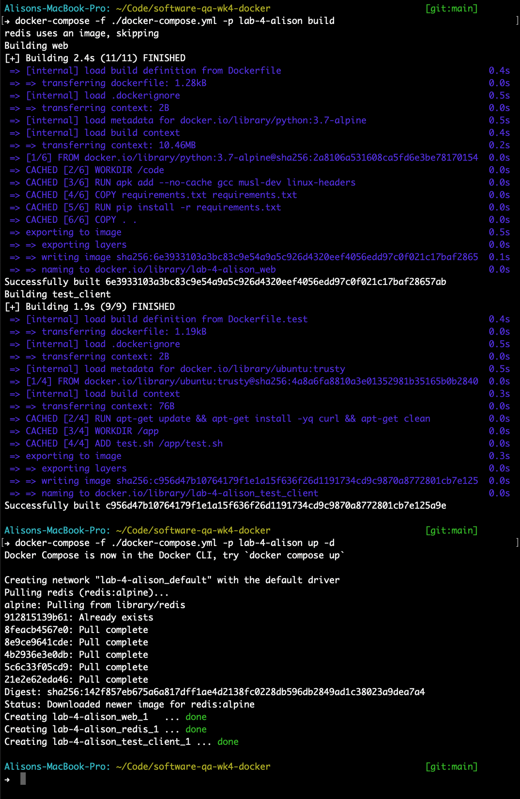
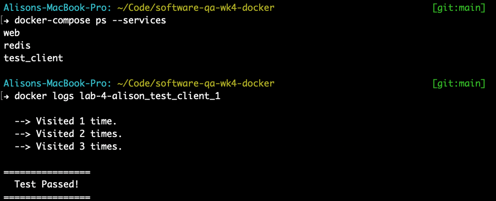

# Lab 4: Docker and System Integration Testing

The goal of this lab exercise is to explore the use of docker-compose to automate full stack/end-to-end system integration tests. Docker-compose facilitates the creation of an entire environment of services along with their dependencies using easy to understand scripting language. 

The system we will use in this lab consists of a Flask simple webapp that keeps track and displays the number of visitors. The Flask app uses a Redis instance to store and counts the number of visitors. Docker-compose will be used to bring up the Flask app and its Redis dependency. 

Besides the app, a test driver script running on a separate container will be used to initiate an http query, parse the result, and assert the output.

## test.sh script

Script that use curl, parses out the visits number and prints out PASSED or FAILED.

Please see [test.sh](../test.sh) 

```shell
#!/bin/bash

visit1=$(curl -s http://web:5000/ |sed 's/Hello World.*\([0-9]\{1,\}\) times./\1/')
printf "\n  --> Visited %s time." "$visit1"

visit2=$(curl -s http://web:5000/ |sed 's/Hello World.*\([0-9]\{1,\}\) times./\1/')
printf "\n  --> Visited %s times." “$visit2"

visits=$(curl -s http://web:5000/ |sed 's/Hello World.*\([0-9]\{1,\}\) times./\1/')
printf "\n  --> Visited %s times.\n" "$visits"

if [[ $visits -eq 3 ]]
then
   printf "\n================"
   printf "\n  Test Passed!\n"
   printf "================\n\n"
else
   printf "\n================"
   printf "\n  Test FAILED!\n"
   printf "================\n\n"
fi
```

## Dockerfile.test

Docker file for the test machine image.

Please see [Dockerfile.test](../Dockerfile.test)

This file is used to set up the test client, which copies and runs the test files (test.sh)

```
FROM ubuntu:trusty
RUN apt-get update && apt-get install -yq curl && apt-get clean
WORKDIR /app
ADD test.sh /app/test.sh
CMD ["bash", "test.sh"]
```

## docker-compose.yml file

The new docker-compose file with the test driver machine/image added to the test environment.

Please see [docker-compose.yml](../docker-compose.yml)

## Screenshots

### Build

Successful building of docker compose environment:



### Run

Successful run of the end-to-end test:


